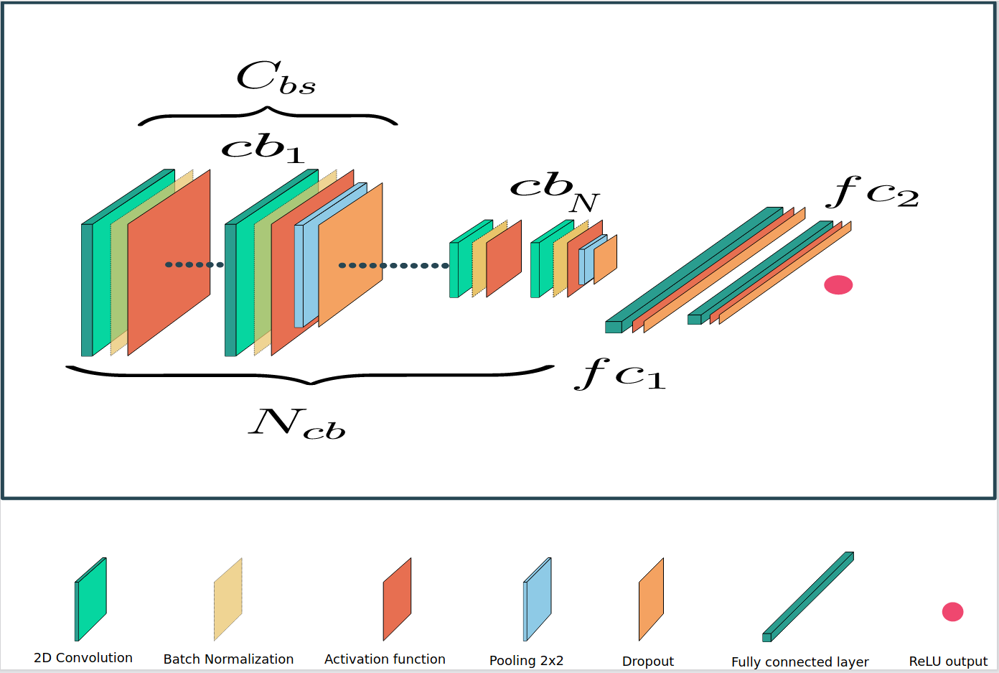

# On the Soundness of XAI in Prognostics and Health Management (PHM)
Source code of the paper "On the Soundness of XAI in Prognostics and Health Management (PHM)". 

#### Objetives

Source code for the paper "Soundness of XAI in Prognostics and Health Management (PHM)".
Objectives

This study evaluates various XAI methods in explaining the predictions made by a time-series regression model. The model was trained on the N-CMAPSS dataset to predict the Remaining Useful Life (RUL) of a turbofan engine.

Five XAI methods (LIME, SHAP, Saliency Maps, LRP, and Grad-CAM) were compared using 8 metrics, or proxies. These proxies are:

    - Identity: Identical objects should receive identical explanations.
    - Separability: Non-identical objects should not receive identical explanations.
    - Stability: Similar objects must have similar explanations.
    - Selectivity: The elimination of relevant variables should negatively impact the prediction.
    - Coherence: The difference between the prediction error and the error from removing non-important features from the signal.
    - Completeness: The percentage of the explanation error compared to the prediction error.
    - Congruency: The standard deviation of the coherence.
    - Acumen: A new proxy proposed in this study, based on the idea that an important feature according to XAI should become one of the least important if it is perturbed.

The comparison was made using 256 randomly selected samples from a test dataset. The score for each method was calculated as the mean of the scores for each sample.

The model used in this study is a 15-layer deep convolutional network with 1514016 parameters.

 


#### Repository Structure

This repository is organized as follows:

    - scoring.py: metrics used to train the model, only required for reading.
    - validate.py: command to validate a proxy.
    - gradcam_search.py: command to validate Grad-CAM using different time and feature contributions.
    - data directory: contains the data used in validation.
    - model directory: contains the tested model.
    - results directory: contains the results from experimentation in pickle format.
    - images directory: contains images shown in this README.
    
#### Installation

The dependencies for this repository are managed with poetry. First, install poetry:

```
pip install poetry
```

Once poetry is installed, create an environment and install all dependencies:

```
poetry install
```

Finally, initialize the environment:

```
poetry shell
```

And you are ready to start executing commands.


# ACKNOWLEDGMENT
This work has been supported by Grant PID2019-109152GBI00/AEI/10.13039/501100011033 (Agencia Estatal de Investigacion), 
Spain and by the Ministry of Science and Education of Spain through the national program "Ayudas para contratos para la 
formacion de investigadores en empresas (DIN2019)", of State Programme of Science Research and Innovations 2017-2020.
